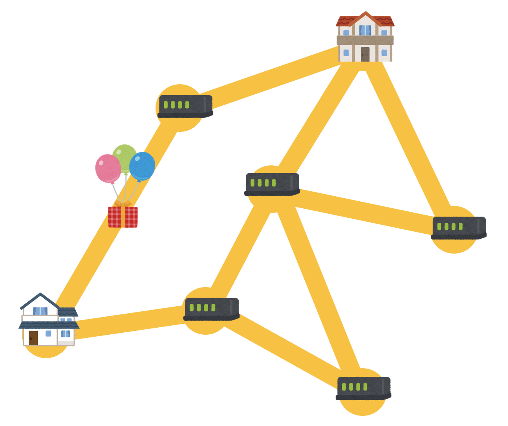
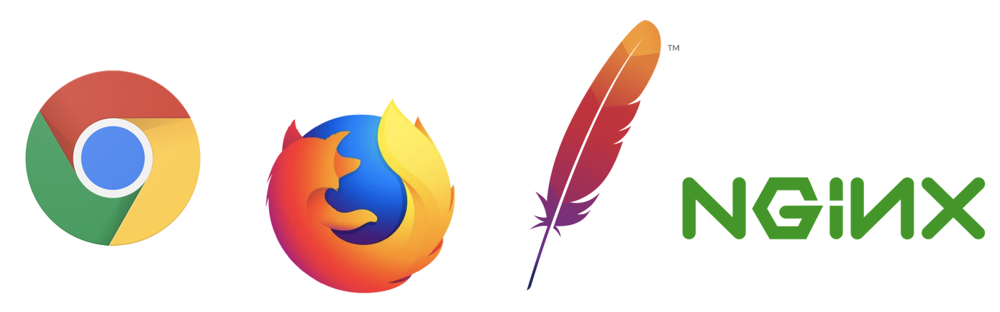
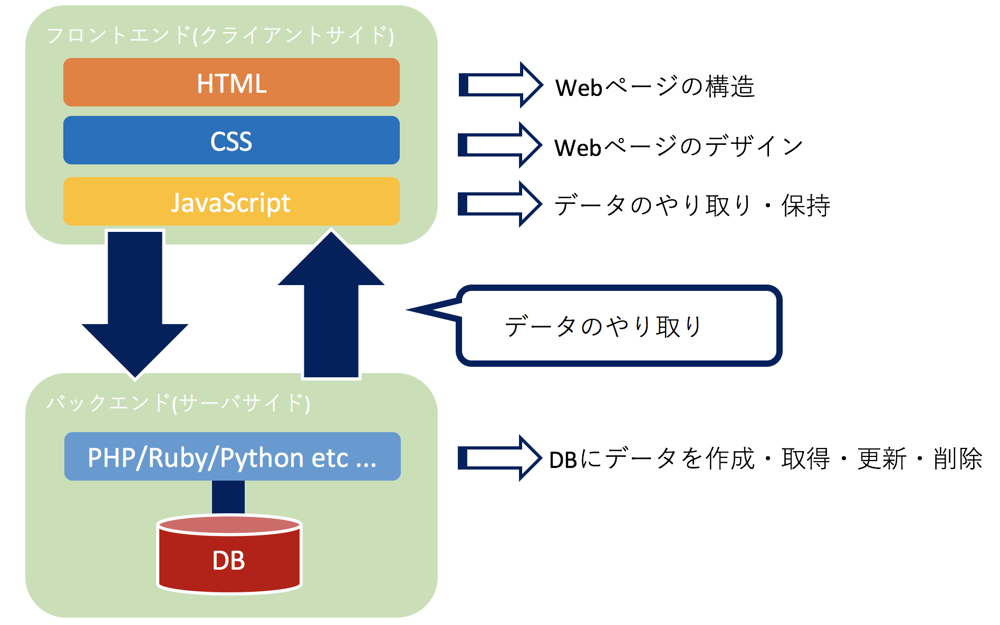

# インターネットとWWW
JavaScriptを学ぶ前にまず, インターネットやWWWがなんたるかについて一度整理しておこう.

インターネットはTCP/IPプロトコルスタックを利用して相互接続されたネットワークのことである.  
例えば, 電子メール(SMTP/POP/IMAP), ファイル転送(FTP/TFTP), **WWW**(**HTTP**)などがある.  
つまり, **WWW**(**World Wide Web**)はインターネットの技術の一部である.

WWWは平たく言うと, GoogleやYahoo!で検索して出てくるようなWebページを見るための仕組みを提供するシステムである.  
プロトコルには**HTTP**を使用し, **HTML**/**CSS**/**JavaScript**といった言語を使用して記述され, 主に**文書のやり取り**を行う.  
文書のやり取りは基本的に**Webブラウザ**(**Google Chrome**, **Firefox**など)と**Webサーバ**(**Apache**, **Nginx**など)の間で行われる.  

# インターネットの略歴

|西暦|概要|
|:--|:--|
|1966|ARPANET計画の開始. ARPANETはインターネットの起源となったネットワークである.|
|1977|OSI参照モデルの策定が開始. 結局, OSIではなくTCP/IPが普及したがネットワークの基本モデルとしては広く参照されるようになった.|
|1972|イーサネットの原型の開発がゼロックス社にて開始される.|
|1973|TCP/IPの開発が開始される.|
|1988|IANAの設立. IANAはIPアドレス・ドメイン名・ポート番号の標準化・管理を行う組織である.|
|1993|WWWを開放することを**CERN**(**欧州原子核研究機構**)が発表. それまでは一部の研究者だけが使える仕組みだった.|
|1993|**NCSA Mosaic**というWebブラウザの誕生. テキストと画像を同一のウィンドウに描画できる最初のブラウザだった.|
|1994|**W3C**の設立. HTML/CSSの標準化を行っている.|
|1998|ICANNの設立. これ以降, IANAはICANNの下部組織となった.|
|2004|**WHATWG**の設立. W3Cの対抗団体として設立されたが, 現在はW3Cと共に仕様の策定を行っている.|
|2014|**HTML5**が勧告される.|

// TODO: JS用に変更する

# Webサービスの仕組み
Webサービスという単語は人によって定義が曖昧なため, ここではWebサービスをWWW上で動作するシステムと定義する.  
Webサービスというものは基本的に以下のような構成で動いている.

**フロントエンド**(**クライアントサイド**)はWebブラウザ上で動く技術の総称で, 主に**HTML**/**CSS**/**JavaScript**といった技術が担当する.  
**バックエンド**(**サーバサイド**)はサーバ上で動く技術の総称で, PHP/Ruby/Python/Node.js/Javaなどのプログラミング言語やDB(MySQL, PostgreSQL)などから構成される.

次に, フォームに値を入力して送信してから, 何かしらの結果が画面上に表示されるまでの流れをざっくりと辿ってみる.  
まず, テキストボックスに「ラーメン」と入力して送信ボタンを押す.  
するとテキストボックスの値をJavaScriptが取得してサーバ側に送信する.  
さらに, サーバ側で動いているプログラムがこの値を受け取り, DBが検索処理など行い, その結果をJavaScriptに返す.  
結果をJavaScriptが受け取ると, その結果をHTMLに描画する.  
JavaScriptを経由せずに送信するケースも存在するが, 近年のWebサービスでは上記で説明したようなパターンが多い.
