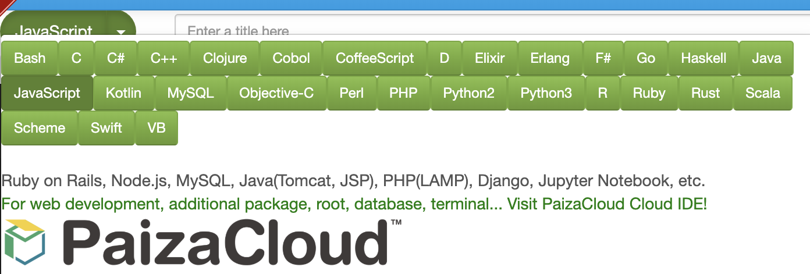
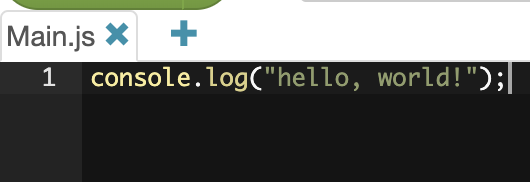
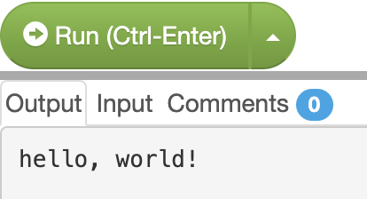

# 学習を進めるにあたって
本書の３章と４章を進めるにあたり, サンプルコードの実行にはpaiza.IOをお勧めする.  
paiza.IOは様々なプログラミング言語のコードをブラウザ上で実行できるWebサービスである.

使い方はまず[paiza.IO](https://paiza.io/)にアクセスし, メニューバーの左上から"New code"を選択する.  


次に, 左上のセレクトボックスから使用する言語(今回はJavaScript)を選択する.



あとは黒いテキストエリアにコードを書き, "→ Run (Ctrl-Enter)"を押すとコードが実行される.



実行結果は画面下部の白い領域に結果が表示される.  
エラーが発生した場合はエラーの内容が表示される.



# hello, world!
まずは慣例に従い, 世界に挨拶してみよう.

```js
console.log("hello, world!");
```

このコードを実行すると, コンソール上に"hello, world!"という文字列が表示されるだろう.

# コメント
**コメント**とは, プログラム中に書けるメモ書きのようなもので, プログラムの動作自体には影響しない.  
コメントには, 「そのコードがどういった機能を提供するのか」や「どういった点に気をつけるべきか」といったものを記述するのに使われることが多い.

コメントには, **一行コメント**と**複数行コメント**の２種類の書き方がある.

```js
// 一行コメント

/*
複数行コメント
複数行コメント
*/
```

# 変数の宣言と代入
プログラミング言語には, 数値や文字列などのデータに名前をつけて繰り返し使用できるようにする**変数**という機能がある.  
例えば以下のコードはJavaScriptにおける変数の宣言であり, `food`という変数を定義している.

```js
let food;
```

また, 変数には値を代入することができる.  
数学では`=`は「左辺と右辺が等しい」という意味を持つが, 多くのプログラミング言語では「右辺を左辺に代入する」という意味を持つため注意する.  

```js
let food;
food = "おすし";
```

変数の宣言と代入は同時に行えるため, 大抵の場合は以下のように変数の宣言と代入を行う.

```js
let food = "おすし";
```

上の説明では変数宣言のキーワードとして`let`を用いたが, `let`, `var`, `const`の３種類が存在する.  
このうち, `var`は最も古くからあり, 意図しない動作を作り込みやすいということから, 後に`let`と`const`が導入された.  
`let`は再代入が可能だが, `const`は再代入ができないといった特徴を持っている.

以下のコードは`let`を使って変数を定義しているため, 再代入しても問題ない.

```js
let food = "おすし";
food = "やきにく";
```

しかし, 次のコードは`const`を使って変数を定義しているため, 再代入すると`Uncaught TypeError: Assignment to constant variable.`といったエラーが発生する.

```js
const food = "おすし";
food = "やきにく";
```

また, `const`で宣言された変数は必ず初期化する必要がある.  
以下のコードは`Uncaught SyntaxError: Missing initializer in const declaration`というエラーが発生する.

```js
const foo;
```

これまでの内容をまとめると, 変数は基本的に,
- `var`は使用しない
- `let`は再代入する必要がある場合のみ使用する
- `const`を極力使用する

というルールを守ると良い.

# 変数の複数宣言

変数を複数宣言する場合, `,`(カンマ)区切りで簡潔に宣言することができる.  
以下のコードでは, `foo`, `bar`, `baz`の３つの変数が宣言される.

```js
let foo, bar, baz;
const foo = "foo", bar = "bar", baz = "baz";
```

# 変数名に扱える文字

変数名には半角アルファベット(`a`〜`z`, `A`〜`Z`), 数字(`0`〜`9`)アンダースコア(`_`), ダラー(`$`)を組み合わせた文字を使用できる.

```js
let $Foo_334;
```

ただし, 変数名の先頭に数字を使用することはできない.  
以下のコードでは, `Uncaught SyntaxError: Unexpected number`というエラーが発生する.

```js
const 114514 = "1919810";
```

また, **予約語**を変数名に使用することはできない.  
予約語は変数宣言に使用する`var`や`let`, 制御構文の`if`や`for`(後述)などの言語構造のことである.  
予約語に関しては, [MDN 予約語](https://developer.mozilla.org/ja/docs/Web/JavaScript/Reference/Reserved_Words)にまとめられているため, 一読しておくと良い.  
以下のコードでは, `Uncaught SyntaxError: Unexpected token if`というエラーが発生する.

```js
const if = "予約語";
```

また, 変数を定義する際の命名規則として, 一単語目の先頭が小文字でそれ以降の単語の先頭が大文字の**キャメルケース**を使用することをお勧めする.

// TODO: エビデンス

```js
const foodName = "おすし";   // キャメルケース
const food_name = "おすし";  // スネークケース
```

# データ型とリテラル
JavaScriptには, 様々な**データ型**が存在する.  
データ型とは, 例えば文字列型や数値型のことである.

データ型は**プリミティブ型**と**オブジェクト**の２種類に大別される.

プリミティブ型とはその名の通り, 基本的なデータ型のことである.  
プリミティブ型には次のような種類が存在する.

|型名|説明|
|:--|:--|
|真偽値(Boolean)|`true`または`false`を表現できる.|
|数値(Number)|`334`や`3.14`などの数値を表現できる.|
|文字列(String)|`"foo"`や`"bar"`などの文字列を表現できる.|
|undefined|値が未定義であることを表現できる.|
|null|値が存在しないことを表現できる.|

他にもシンボル(Symbol)というデータ型も存在する.

一方, オブジェクトはプリミティブ型以外のデータ型のことを指す.  
オブジェクトには, (狭義の)オブジェクト, 配列, 関数, 正規表現, Dateなどが存在する.  
このうちオブジェクトと配列, 関数は特に使用頻度が高いため, 後ほど解説する.

プリミティブ型やオブジェクトは, **リテラル**を使用することで簡単に定義できるようになる.  
リテラルとは, プログラム上で数値や文字列など、直接記述した内容がそのデータ型の値を書ける構文として定義したものである.  
例えば文字列の場合は`"`で文字列を囲むことで文字列型のデータを定義することができる.  
リテラル表現が用意されていないデータ型の場合, その値を作る関数を使用して作成する必要がある.  

以下に挙げる７種類のデータ型に関しては, リテラル表現が用意されている.
- 真偽値
- 数値
- 文字列
- null
- オブジェクト
- 配列
- 正規表現

# 演算子
**演算子**はよく利用する演算処理を記号などで表現したものである.  
例えば代入を表現する代入演算子(`=`)や, 加算を表現する加算演算子(`+`)などである.

演算子は演算する対象を持ち, この対象のことを**被演算子**(**オペランド**)という.  
例えば,

```js
const food = "おすし";
```

というコードの場合, 演算子が`=`, オペランドが`food`, `"おすし"`のため,

```
<オペランド> <演算子> <オペランド>
```

という構成になる.

オペランドの数に応じて, **単項演算子**, **二項演算子**, **三項演算子**と分類される.  
上の例ではオペランドを２つ取っているため, 代入演算子は二項演算子である.

// TODO: 演算子の説明

+, -, *, /, %,

+, -, ++, --

==, ===, !==, !=
> < >= <=

論理演算子

# 配列
**配列**は, 値に順序をつけて格納できるデータ構造である.  
配列は以下のように記述する.

```js
const empty = [];
const foods = ["おすし", "やきにく", "ラーメン"];
```

配列に格納したそれぞれの値("おすし", "やきにく", "ラーメン")のことを**要素**と呼ぶ.
また, それぞれの要素は**添字**や**インデックス**と呼ばれる番号を持っており, 先頭の要素から`0`,`1`,`2`と割り振られる.  
各要素へのアクセスには添字演算子(`[]`)を用い, インデックスを指定してアクセスする.

```js
const foods = ["おすし", "やきにく", "ラーメン"];
console.log(foods[0]); // "おすし"
```

また, JavaScriptにおける配列は可変長であるため, 後から配列へ要素を追加・挿入・削除することができる.  

// TODO: 例

# オブジェクト
**オブジェクト**とは, **プロパティ**を集めたデータ構造である.  
オブジェクトは以下のように記述する.

```js
const food = {
  "name": "おすし",
  "price": 200,
};
```

プロパティとは, キーと値が対になったものである.  
上の例で言うと, `name`や`price`はキー, `"おすし"`や`200`は値である.  
キーには文字列かシンボルが利用でき, 値には任意のデータ型を利用できる.  
そのため, プロパティの値にさらにオブジェクトを定義することもできる.

また, キーに指定する文字列は`"`を省略することができる.  

```js
const food = {
  name: "おすし",
  price: 200,
};
```

ただし, `-`(ハイフン)が含まれる場合は`"`を省略することができない.

```js
const obj = {
  "your-name": "たかし",    // OK
  your-name: "かずきち",    // NG
};
```

// TODO: 配列とオブジェクトの組み合わせ

# 制御構文
制御構文とは, プログラムの処理の流れを制御するための構文のことである.

# if文
if文は条件分岐を提供する制御構文である.  
以下のコードは, if文の基本形である.  
条件式の評価結果が`true`であるならば, 処理が実行される.

```js
if (条件式) {
  処理;
}
```

次のコードは, 条件式が`true`であるため, 処理が実行される.

```js
if (true) {
  console.log("この処理は実行される");
}
```

また, if文内の処理が１行の場合, `{}`を省略することができる.

```js
if (true) console.log("この処理は実行される");
```

if文は条件式に比較演算子などを使用し, その比較結果によって処理を分岐するためによく使用される.

```js
const num = 60;
if (num > 50) {
  console.log("numは50より大きな値");
}
```

複数の条件分岐を記述する場合, if文に続けてelse if文やelse文を使用する.  
else文はどの条件にもマッチしなかった場合に実行される.

```js
const num = 60;
if (num > 100) {
  console.log("numは100より大きな値");
}
else if (num > 50) {
  console.log("numは50より大きな値");
}
else {
  console.log("numは50以下の値");
}
```

# switch文
switch文は式の評価結果が, 指定した値である場合に実行する処理を並べて記述する.  

```js
const num = 2;
switch (num) {
  case 1:
    console.log("numの値は1");
    break;
  case 2:
    console.log("numの値は2");
    break;
  case 3:
    console.log("numの値は3");
    break;
  default:
    console.log("numの値は1, 2, 3以外");
    break;
}
```

`default`を使用することで, 式の評価結果に関わらず, 処理が実行される.  
上記のコードはbreak文を使用しているため, `default`内の処理は実行されない.  
break文がない場合, switch文は最後まで式の評価結果と指定した値を比較し続ける.

## 反復処理
for文やwhile文などを使用することで反復処理を記述できる.

# for文
for文は繰り返す範囲を指定した反復処理を記述できる.

```js
for (初期化式; 条件式; 増分式) {
    処理;
}
```

for文の実行フローは次のようになる.

1. 初期化式で変数宣言
2. 条件式の評価結果が`true`なら3へ, `false`なら終了
3. 処理を実行
4. 増分式で変数を更新
5. 2へ戻る

```js
let total = 0;

for (let i = 0; i < 10; i++) {
  total += i + 1;
}
console.log(total); // => 55
```

# for of

# for in

# while

# break

# continue

# return

# 様々な関数
即時関数(滅びた), 関数宣言, 関数式, アロー関数, this

# undefined, Null, NaN
