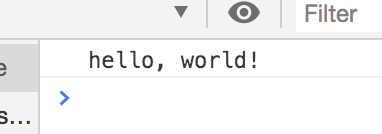

# 書籍管理アプリの作成
さて, ４章は実践編ということで簡単な書籍管理アプリを作ってみよう.

書籍管理アプリでは,
- 書籍をISBNで検索する機能
- 書籍を本棚に追加する機能
- 書籍を本棚から削除する機能

の主に3つを実装する.

※ISBNとは書籍を一意に識別するためのコードである.  
10桁と13桁のコードが存在する.  
ISBNは基本的に書籍の裏面に書かれている.

# ファイルとディレクトリの作成
まずは必要なファイルとディレクトリを作成する.
構成は以下の通りである.

```
bookshelf
├ app.js
└ index.html
```

# 下準備
まず, index.htmlから記述する.  

```html
<!DOCTYPE html>
<html lang="ja">
  <head>
    <meta charset="utf-8">
    <title>書籍管理アプリ</title>
  </head>
  <body>
    <main>
      <input type="text" id="isbn" placeholder="isbn">
      <button type="button" id="search">検索</button>
      <div id="result"></div>
      <ul id="bookshelf"></ul>
    </main>
    <script src="./app.js"></script>
  </body>
</html>
```

ISBNを入力するテキストボックス, 書籍を検索するボタン, 検索結果を表示するdiv要素, 書籍を追加するul要素を記述する.  
また, app.jsを読み込むためにscript要素を記述する.

次にapp.jsが読み込めているかどうかを確認する.  
以下のコードをapp.jsに記述する.

```js
console.log("hello, world!");
```

デベロッパーツールのConsoleを開く.  
ブラウザがChromeの場合, WindowsはF12キーを押すことでデベロッパーツールが開く.  
Macはoptionキー, commandキー, iキーを同時に押すことでデベロッパーツールが開く.

以下の画像の様に, Console内に`hello, world!`と表示されていれば, app.jsが読み込めている.



# Web APIを叩く
WebAPIとは、簡潔に言うと、ネットワーク(HTTP)越しに利用できる関数である.  
URLが関数名を指し、引数を渡すことで結果を取得したり更新したりすることができる.  
WebAPIの呼び出し方(HTTPメソッド)には複数の種類がある.

|メソッド名|説明|
|:--|:--|
|GET|リソースの取得.|
|POST|子リソースの作成, リソースへのデータ追加, その他処理.|

その他にも, PUTやPATCH, DELETEなどがある.

今回作成する書籍管理アプリでは, Googleが提供している[Google Books APIs](https://developers.google.com/books/)を使用する.
使用するためには, HTTP通信をする必要がある.  
Webブラウザ上でHTTP通信するために, Fetch APIを使用する.

Fetch APIはHTTP通信を行いリソースを取得するためのAPIである.  
Fetch APIを使用することで, ページ全体を再読み込みすることなく指定したURLからデータを取得することができる.  
Fetch APIはHTTP通信を扱うXMLHttpRequestと似たAPIだが, より強力で柔軟な操作が可能である.  

実際にFetch APIを使用し, 書籍(レスポンス)を取得する.  

```js
const isbn = "479737702X";
fetch(`https://www.googleapis.com/books/v1/volumes?q=isbn:${isbn}`).then(response => {
  if(response.ok) {
    response.json().then(book => {
      console.log(book)
    });
  } else {
    console.log("サーバーエラーです。");
  }
}).catch(error => {
    console.log("ネットワークエラーです。");
});
```

`fetch`メソッドを使用し, HTTPリクエストを送信する.  
送信したリクエストにレスポンスが返却されると, `then`コールバックが呼び出される.  
リクエストが成功したかどうかは, `ok`プロパティを使用する.  
`ok`プロパティは, HTTPステータスコードが200番台であれば`true`を返し、400や500番台であれば`false`を返す.  
`json`メソッドは, HTTPレスポンスをJSONとしてパースする.  
HTTP通信にはエラーがつきものである.  
`catch`メソッドを使用し, エラーをハンドリングする.

# 書籍管理アプリを作成する

## 書籍の検索
まず, 書籍を検索する機能を作成する.  
先ほどのFetch APIを使用する.  
また, テキストボックスに値を入れていない場合, `入力してください。`とConsoleに表示されるようにする.

```js
const books = [];

// 書籍の検索
const searchBook = () => {
  const isbn = document.getElementById("isbn");
  if (isbn.value.length === 0) {
    console.log("入力してください。");
    return;
  }
  fetch(`https://www.googleapis.com/books/v1/volumes?q=isbn:${isbn.value}`).then(response => {
    if(response.ok) {
      response.json().then(book => {
        if ("items" in book)  console.log(book.items[0].volumeInfo);
        else                  console.log("該当する書籍が見つかりませんでした。");
      });
    } else {
      console.error("サーバーエラーです。");
    }
  }).catch(error => {
    console.error("ネットワークエラーです。");
  });
};

document.getElementById("search").addEventListener("click", searchBook);
```

前項でFetch APIの説明をしたのでここでは省略する.  
`addEventListener`メソッドは, 特定のイベントが対象に配信されるたびに呼び出される関数を定義する.  
イベントには`click`や`keydown`, `scroll`など複数の種類がある.  
今回は検索ボタンをクリックした際に, イベント(`searchBook`)が発火する.

## 検索結果の表示
次に, 検索結果を表示する.  
検索結果を表示するために, 前項(書籍の検索)で記述したsearchBookメソッドを修正する.  
また, 書籍を本棚に追加するための追加ボタンを作成するためのメソッドも作成する.

```js
...

// 書籍の検索
const searchBook = () => {
  const isbn = document.getElementById("isbn");
  if (isbn.value.length === 0) {
    showErrorResult("入力してください。");
    return;
  }
  fetch(`https://www.googleapis.com/books/v1/volumes?q=isbn:${isbn.value}`).then(response => {
    if(response.ok) {
      response.json().then(book => {
        if ("items" in book)  showSuccessResult(book.items[0].volumeInfo);
        else                  showErrorResult("該当する書籍が見つかりませんでした。");
      });
    } else {
      showErrorResult("サーバーエラーです。");
    }
  }).catch(error => {
    showErrorResult("ネットワークエラーです。");
  });
};

...

// 検索結果の表示
const showSuccessResult = book => {
  let result = document.getElementById("result");
  result.textContent = null;

  const title = book.title;
  const authors = book.authors.join(", ");
  const description = "description" in book ? book.description : "";
  const button = makeButton("add-book", "追加");

  result.appendChild(document.createElement("h2")).appendChild(document.createTextNode(title));
  result.appendChild(document.createElement("div")).appendChild(document.createTextNode(`著者: ${authors}`));
  result.appendChild(document.createElement("div")).appendChild(document.createTextNode(description));
  result.appendChild(button);
};

// エラーメッセージの表示
const showErrorResult = text => {
  let result = document.getElementById("result");
  result.textContent = null;
  result.appendChild(document.createElement("p")).appendChild(document.createTextNode(text));
};

// ボタンの作成
const makeButton = (id, text) => {
  const button = document.createElement("button");
  button.setAttribute("type", "button");
  button.setAttribute("id", id);
  button.appendChild(document.createTextNode(text));
  return button;
};
```

書籍が見つかった際は`showSuccessResult`メソッドを, 見つからなかった, エラー時は`showErrorResult`メソッドを使用する.  
以下に使用しているメソッドを紹介する.

|メソッド名|説明|
|:--|:--|
|join|配列の全要素を順に連結した文字列を新たに作成し, それを返す.<br>引数には要素の区切り方を指定できる.|
|appendChild|特定の親要素に引数で指定した子要素を追加する.|
|createElement|引数に指定した要素を作成する.|
|createTextNode|`Text`ノードを作成する.|
|setAttribute|特定の要素に属性とその値を追加する.|
|textContent|特定の要素のテキストおよびその子孫のテキストの内容を表す.|

```js
result.appendChild(document.createElement("h2")).appendChild(document.createTextNode(title));
```

上記のコードはメソッドチェーンと呼ばれ, メソッドをつなげて処理する.  
上記の処理は以下のように処理される.

1. `result`へh2要素を追加する.
2. 追加したh2要素にテキスト(今回の場合, 書籍のタイトル)を追加する.

## 本棚の表示
最後に検索結果を本棚に追加し, 表示する.  
前項(検索結果の表示)で作成した追加ボタンに`addEventListener`メソッドを使用し, クリックイベントを追加する.  
また, 本棚の書籍を削除する機能も作成する.

```js
...
// 検索結果の表示
const showSuccessResult = book => {
  ...
  result.appendChild(document.createElement("h2")).appendChild(document.createTextNode(title));
  result.appendChild(document.createElement("div")).appendChild(document.createTextNode(`著者: ${authors}`));
  result.appendChild(document.createElement("div")).appendChild(document.createTextNode(description));
  result.appendChild(button);
  
  document.getElementById("add-book").addEventListener("click", () => addBook(book));
};

...

// ボタンの作成
const makeButton = (id, text) => {
  ...
};

// 本棚の表示
const showBookshelf = () => {
  const bookshelf = document.getElementById("bookshelf");
  bookshelf.textContent = null;
  for (let [i, book] of books.entries()) {
    const li = document.createElement("li");
    const button = makeButton(`delete-book-${i}`, "削除");

    bookshelf.appendChild(li);
    li.appendChild(document.createTextNode(`${book.title}: ${book.authors}`));
    li.appendChild(button);

    document.getElementById(`delete-book-${i}`).addEventListener("click", () => deleteBook(i));
  }
};

// 書籍の追加
const addBook = book => {
  books.push({ title: book.title, authors: book.authors.join(", ") });
  showBookshelf();
};

// 書籍の削除
const deleteBook = i => {
  books.splice(i, 1);
  showBookshelf();
};
```

|メソッド名|説明|
|:--|:--|
|push|配列の末尾に1つ以上の要素を追加する.|
|splice|古い要素を取り除きつつ新しい要素を追加することで, 配列の内容を変更する.|

これで書籍管理アプリが完成した.

# 進化させよう

今回は簡単な書籍管理アプリを作ってきたが、このアプリには足りていない機能が多くある.  
例えば,
- 同じ書籍を何度も追加できる(バリデーション)
- ISBNのフォーマットに合っていなくても検索できる(バリデーション)
- リロードすると消えてしまう(localStorageを使ったりサーバサイドを書く)

余裕のある方は是非試してみてほしい.
